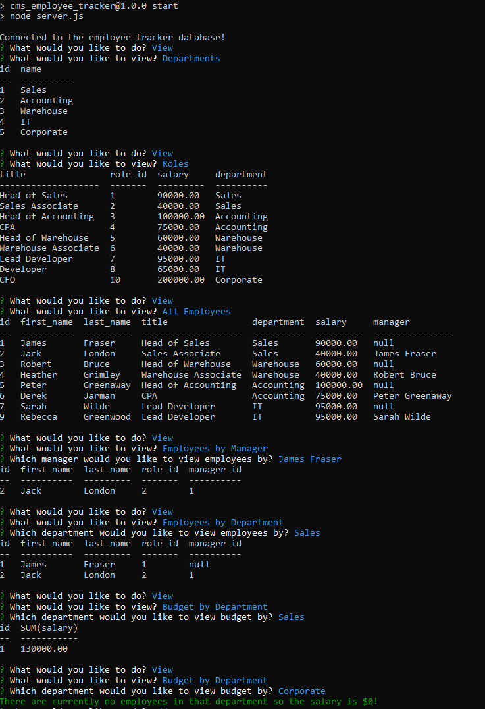
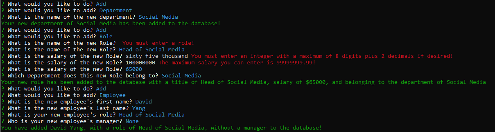
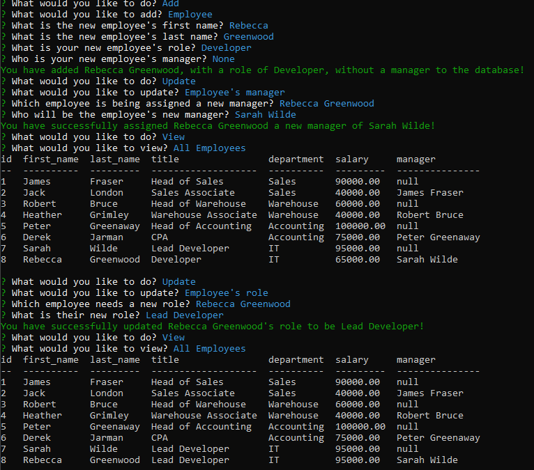
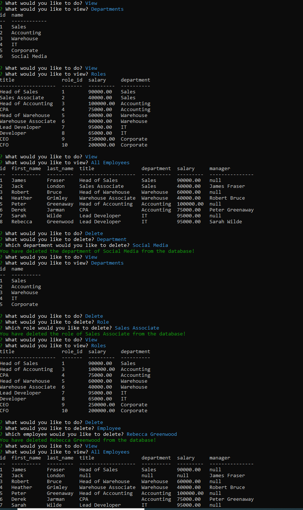

[](https://opensource.org/licenses/MIT)

# CMS Employee Tracker

## Description

This project serves as a fairly powerful and comprehensive database tool. It can track all the employees of any business. There are four main options supplied with this project: View, Add, Update, and Delete. Some of its features include, but are not limited to: viewing total budget for a certain department based on that department's employees and those contained employee's roles, viewing employees by manager, viewing employees by department, adding new employees/roles/departments, updating employee's role/manager, and deleting employees/roles/departments.

Below is a walkthrough video that will show anybody who wishes to use this application how to do so.

Walkthrough Video:

https://www.youtube.com/watch?v=JTPSB-yj5jk

## Table of Contents

* [Screenshots](#screenshots)
* [Installation](#installation)
* [Usage](#usage)
* [License](#license)
* [Questions](#questions)

## Screenshots

View



Add



Update



Delete



## Installation

In order to install this application, your first step would be to clone the repo onto your local machine. Once the repo is cloned to your machine, you will need to open up your terminal and navigate to the root of this project's folder. Once you're there run this command:

```
npm install
```

You will also need to have mysql installed to your machine. Please refer to online documents to get mysql up and running (I used [this one](https://coding-boot-camp.github.io/full-stack/mysql/mysql-installation-guide)).

Once mysql is successfully installed, and you are in the root of the project directory, please log into the database using:

```
mysql -u root -p
```

This will prompt you for the password you chose when you first installed mysql.
Once you're in, please run the following commands in mysql:

```
source db/schema.sql;
```
```
source db/seeds.sql;
```

You should be ready to go afterwards!

## Usage

In order to use this project, be sure you are at the root of the project in your terminal/git bash. Once you're there invoke this command:

```
npm start
```

## License

Copyright 2021 Alex Sadrgilany

Permission is hereby granted, free of charge, to any person obtaining a copy 
of this software and associated documentation files (the "Software"), to deal 
in the Software without restriction, including without limitation the rights to 
use, copy, modify, merge, publish, distribute, sublicense, and/or sell copies of the 
Software, and to permit persons to whom the Software is furnished to do so, 
subject to the following conditions:

The above copyright notice and this permission notice shall be included in all 
copies or substantial portions of the Software.

THE SOFTWARE IS PROVIDED "AS IS", WITHOUT WARRANTY OF ANY KIND, EXPRESS OR IMPLIED, 
INCLUDING BUT NOT LIMITED TO THE WARRANTIES OF MERCHANTABILITY, FITNESS FOR A 
PARTICULAR PURPOSE AND NONINFRINGEMENT. IN NO EVENT SHALL THE AUTHORS OR COPYRIGHT 
HOLDERS BE LIABLE FOR ANY CLAIM, DAMAGES OR OTHER LIABILITY, WHETHER IN AN ACTION OF 
CONTRACT, TORT OR OTHERWISE, ARISING FROM, OUT OF OR IN CONNECTION WITH THE SOFTWARE 
OR THE USE OR OTHER DEALINGS IN THE SOFTWARE.

## Questions

[My GitHub Profile](https://github.com/asadg7)

To reach me with questions, please email: asadrgilany7@gmail.com

